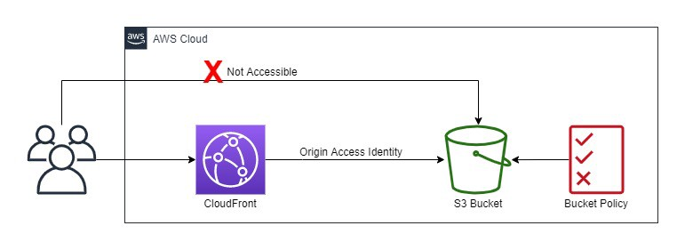

# Infrastracture for SPA Static Website hosting
This module is designed to deliver infrastructure to support hosting static website hosting using CloudFront and S3.

## Inputs

| Name | Description | Type | Default | Required |
|------|-------------|------|---------|:--------:|
|  [name](#input\_name) | Application or Project friendly name. | `string` | `[]` | yes |
|  [aliases](#input\_aliases) | FQDNs for CloudFront Distribution. | `string(list)` | `[]` | yes |
|  [cert\_arn](#input\_cert\arn) | ACM Certificate ARN for Domains. | `string` | `""` | yes |
|  [bucket\_name](#input\_bucket\name) | Bucket name for site hosting. | `string` | `""` | yes |
|  [logging\_enabled](#input\_logging\_enabled) | CloudFront logging enabled. | `bool` | `false` | no |
|  [include\_cookies](#input\_include\_cookies) | Included cookies in logging (required if logging enabled). | `bool` | `null` | no |
|  [prefix](#input\_prefix) | Prefix name for WAF logs (required if logging enabled). | `bool` | `null` | no |
|  [allowed\_roles](#input\_allowed\_roles) | Role for CICD deployment pipeline. | `string(list)` | `[]` | no |
|  [price\_class](#input\_price\_class) | Price class for CloudFront deployment. | `string` | `"PriceClass_All"` | no |
|  [geo\_restriction](#input\_geo\_restriction) | Geo restrictions for CloudFront. | `string` | `"none"` | no |
|  [waf\_enabled](#input\_waf\_enabled) | Enable WAF for CloudFront Distribution. | `bool` | `false` | no |
|  [default\_action](#input\_default\_action) | Default WAF ACL action. | `string` | `allow` | no |
|  [waf\_logging\_enabled](#input\_waf\_logging\_enabled) | Enable WAF logs to CLoudWatch Logs Group. | `bool` | `false` | no |
|  [ip\_sets\_rule](#input\_ip\_sets\_rule) | IP Sets Rule to pass through to WAF ACL. | `list(object)` | `[]` | no |

## Outputs

| Name | Description |
|------|-------------|
|  [spa\_bucket\_arn](#spa\_bucket\_arn) | S3 Bucket ARN required for creation of CICD Role Permissions |

## Future Improvements
* KMS CMK for CloudFront S3 Bucket (is this required and is this supported?)
* Logging lifecycle policies